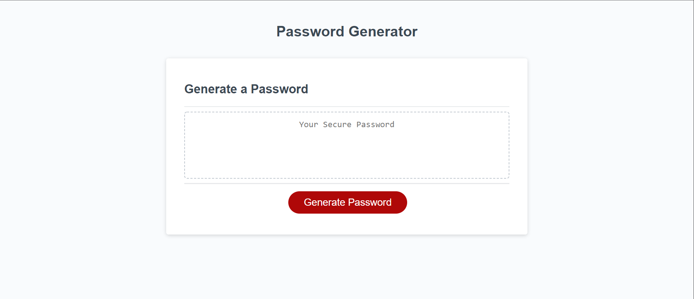

# 03 JavaScript Challenge: Password Generator
 
## Description
 
This project is a single page website that allows a user to generate a random password of a specific length and with various character types.

Users can generate passwords to replace their current ones from time to time. An additional feature of the webpage is that users can choose to include special characters, numbers and letters in both upper and lower case. This allows users to generate very strong passwords that may be required in some cases. Users can also exclude character types in order to generate a weaker password that may be easier to remember.
 
## Table of Contents
 
- [Usage](#usage)
- [Credits](#credits)
- [License](#license)
 
## Usage
 
The website is live on the open web and can be accessed at https://abdallajama201.github.io/Challenge-03-JavaScript//

When a user presses the red generate password button. They are prompted with a set of options to specify their password by length and character types to include. When valid inputs are given the password is printed in the box containing the phrase "Your Secure Password". If the user presses the red button again the process starts over and the new password replaces the previous one.
 
A photo of the mockup is available below.
 

  
## Credits
 
The original webpage were provided by [Trilogy Education Services](https://www.trilogyed.com/universities/) and the [School of Continuing Studies - University of Toronto](https://learn.utoronto.ca/)
 
## License
 
 This project is under the MIT License with language provided by the Open Source Initiative.